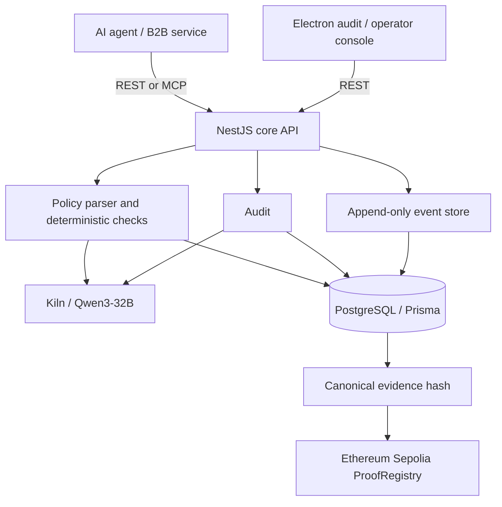

# Agent Financial Black Box

**Every AI payment should be explainable.**

> **LLM interprets. Code enforces. Blockchain proves.**

Agent Financial Black Box is audit and control infrastructure for AI agents that spend on behalf of users. It preserves the user's instruction, the agent's proposed action, the policy decision, explicit human approval, an externally reported payment, and the later audit in one evidence timeline.

## Problem

A payment record shows what was charged, but not what a user authorized or why an agent thought the purchase was allowed. The gap matters when an agent's proposed amount differs from the final charge. Investigators need to reconstruct both the decision and the evidence behind it.

## Solution

Kiln's **Qwen3-32B** extracts structured constraints from natural language. NestJS code enforces the budget, merchant, and deadline rules. Append-only, hash-linked events preserve the lifecycle; an optional Ethereum Sepolia proof anchors a deterministic evidence hash. A later audit uses Qwen3-32B to explain server-calculated findings. The platform has a REST API, six MCP tools, and an Electron audit console.

The service **records external payment results**. It does not execute a payment or infer human approval. A successful external payment can still be recorded after a policy block, so a bypass remains visible and auditable.

## Architecture



| Workspace | Responsibility |
| --- | --- |
| `apps/api` | NestJS Case and Event workflows, deterministic checks, audit, usage, proof API, Swagger |
| `apps/mcp` | Stateless Streamable HTTP MCP adapter; delegates business operations to REST |
| `apps/desktop` | Electron + React audit console |
| `packages/shared` | Shared enums, API contracts, and Zod schemas |
| `packages/blockchain` | Solidity `ProofRegistry`, canonical hashing, and Sepolia client |

Monetary API values are fixed decimal strings such as `"50.00"`; Prisma stores them as `Decimal`. Events are append-only, sequenced per Case, and linked by the prior event hash. `(caseId, idempotencyKey)` prevents duplicate event creation.

## Three demo scenarios

| Case | Evidence | Result |
| --- | --- | --- |
| [Compliant](docs/demo/final-demo-script.md) · `cmumtu7n70000u8yw4v07evjp` | $50.00 Amazon policy; $45.00 total; explicit approval; external successful payment | `VERIFIED`, `COMPLIANT`, Sepolia proof verified |
| Blocked · `cmunels8q000cp0yw55p4it62` | $30.00 policy; $42.00 proposal including fee | `BLOCK`, `BUDGET_EXCEEDED`, `PAYMENT_BLOCKED`; no successful payment |
| Disputed · `cmumtuehv0007u8yw31ptuymh` | $30.00 policy; $28.00 proposal; external $28.00 subtotal + $4.00 fee = $32.00 | `DISPUTED`, audit `VIOLATION / MAX_AMOUNT`, Sepolia proof verified |

The disputed Case is the core story: verified evidence can show a financial violation. **Proof integrity is not proof of policy compliance.**

## Qwen3-32B usage

- **Policy extraction:** Kiln's Qwen3-32B reads the latest `USER_INSTRUCTION` and returns maximum amount, currency, allowed merchants, and deadline. A shared Zod schema validates the response before a versioned Policy is saved.
- **Audit explanation:** The API first calculates payment-policy checks, including fees. Qwen explains the recorded evidence; contradictory model verdicts are rejected.
- Kiln credentials stay in the API process. The Electron renderer and MCP adapter do not receive the key.

## Deterministic policy engine

`MAX_AMOUNT`, `ALLOWED_MERCHANT`, and `DEADLINE` checks run in code. Qwen does **not** compare amounts, merchants, or deadlines. A `BLOCK` is returned as HTTP 200 because it is a valid business result; the API writes `POLICY_CHECK` and, when appropriate, `PAYMENT_BLOCKED`, and sets the Case to `BLOCKED`. No successful payment is created automatically.

## Blockchain evidence design

The proof endpoint reconstructs a canonical Case evidence snapshot, hashes it with keccak256, and commits only a hashed Case identifier and `recordHash` to `ProofRegistry`. Raw instructions, user identifiers, and financial details stay off-chain. The proof snapshot stops at its recorded evidence sequence, so its own `PROOF_RECORDED` event cannot invalidate it. Verification recomputes the saved snapshot hash and compares it with the stored and on-chain proof.

### Real Sepolia proof

- **Chain:** Ethereum Sepolia (`11155111`)
- **Contract:** [`0xb7df386863cf3f1056e25d2b28a3f84b14799430`](https://sepolia.etherscan.io/address/0xb7df386863cf3f1056e25d2b28a3f84b14799430)
- **Deployment:** [`0x6ffbfc180e0ed3984fb5934f8cff6b4a1fa7031a410da03637067e4c09d9f5af`](https://sepolia.etherscan.io/tx/0x6ffbfc180e0ed3984fb5934f8cff6b4a1fa7031a410da03637067e4c09d9f5af)
- **Compliant proof:** [`0x6ee2a53e4d89949d5ed6723ed23b33c7d84f7b8505f96e66114cb1424dca720b`](https://sepolia.etherscan.io/tx/0x6ee2a53e4d89949d5ed6723ed23b33c7d84f7b8505f96e66114cb1424dca720b), block `11810903`
- **Disputed proof:** [`0x935e7762a443f0357885e0b8bdc72073afde68e985636c2395631a3b38a87b96`](https://sepolia.etherscan.io/tx/0x935e7762a443f0357885e0b8bdc72073afde68e985636c2395631a3b38a87b96), block `11810922`

Both prepared proof records returned `verified: true` against Sepolia. The disputed audit returned `proofVerified: true` while correctly reporting `VIOLATION`.

## MCP integration

The MCP Streamable HTTP endpoint is `http://127.0.0.1:3100/mcp`. Its tools are `start_financial_case`, `propose_financial_action`, `record_human_approval`, `record_payment_result`, `audit_financial_case`, and `get_financial_case`. MCP is an adapter to the same NestJS REST API; policy and audit rules remain in the core API.

`pnpm verify:mcp` lists the six tools and runs a real $30-policy / $42-proposal blocked flow. **It creates a new Case**: run it against a development database, not the three-Case presentation database. See [MCP verification](docs/demo/mcp.md).

## REST API

Base URL: `http://localhost:3000/api/v1` · [Swagger UI](http://localhost:3000/docs)

| Endpoint | Purpose |
| --- | --- |
| `POST /cases`, `GET /cases`, `GET /cases/:caseId` | Create and inspect Cases |
| `POST /cases/:caseId/events`, `GET /cases/:caseId/events` | Record user instruction and agent decision; read timeline |
| `POST /cases/:caseId/policy/parse`, `POST /cases/:caseId/policy/check` | Interpret user intent; enforce it deterministically |
| `POST /cases/:caseId/approvals` | Record explicit human approval/rejection |
| `POST /cases/:caseId/payments` | Record an external payment result |
| `POST /cases/:caseId/disputes`, `POST /cases/:caseId/audits` | Record a dispute and explain the outcome |
| `POST /cases/:caseId/proofs`, `GET /cases/:caseId/proofs/verify` | Commit and verify Sepolia evidence |
| `GET /usage/summary` | Model calls and input/output/total tokens |

## Token usage

The API persists `ModelInvocation` usage and latency when Kiln provides them; the console summarizes policy extraction and audit explanation separately. The prepared three-Case fixture contains **8 Qwen calls and 5,091 total tokens** (2,611 input; 2,480 output). These are measured demo-record values, not a claim about every future run. Refresh `GET /api/v1/usage/summary` if the database changes.

## Tech stack

TypeScript · NestJS · Prisma · PostgreSQL · Zod · Kiln / Qwen3-32B · MCP TypeScript SDK v2 · Electron / React / Vite · Solidity · viem · Ethereum Sepolia

## Local setup and run

Requirements: Node.js 24+, pnpm 11+, PostgreSQL 17 or Docker. From the repository root:

```powershell
pnpm install
Copy-Item .env.example apps/api/.env  # only if apps/api/.env does not exist
docker compose up -d postgres
pnpm db:migrate
pnpm build
pnpm demo:import  # optional; requires an empty Case table
pnpm typecheck
pnpm test
```

Set `DATABASE_URL` and `KILN_API_KEY` in ignored `apps/api/.env`. Policy parsing and audit explanation need Kiln access. Existing proof verification needs `CHAIN_RPC_URL`, `CHAIN_ID=11155111`, and `PROOF_CONTRACT_ADDRESS`; a **new** proof also needs a funded `BLOCKCHAIN_PRIVATE_KEY`. Never commit secrets or expose them to Electron. The provided example uses a public Sepolia RPC; `CHAIN_RPC_URL` is replaceable.

Start each service in a separate terminal:

```powershell
pnpm dev:api
pnpm dev:mcp
pnpm dev:desktop
```

The desktop opens the audit console; API docs are at `http://localhost:3000/docs`. `pnpm demo:import` loads the three prepared Cases, their evidence and model usage, and two real proof records from [the fixture](apps/api/prisma/demo-data.json). It sends no new transaction and requires an empty Case table. Configure Sepolia RPC and the deployed contract to verify them. This project's local ignored environment points to a separate `blackbox_demo` database; the development database remains available for write tests.

## Demo and submission

- [Final script, 2:50 target](docs/demo/final-demo-script.md)
- [Recording checklist](docs/demo/recording-checklist.md)
- [Project description and short form](docs/submission/project-description.md)
- [Seven-slide pitch copy](docs/submission/pitch-deck-outline.md)
- [Seven-slide pitch deck (PPTX)](docs/submission/agent-financial-black-box.pptx)

## Roadmap

Future production work includes signed agent identities, payment-provider integrations, richer policy templates, webhook ingestion, an asynchronous event pipeline, enterprise access control, agent-to-agent audit, and production-grade verifiable evidence options. These are future directions, not features claimed for this prototype.
